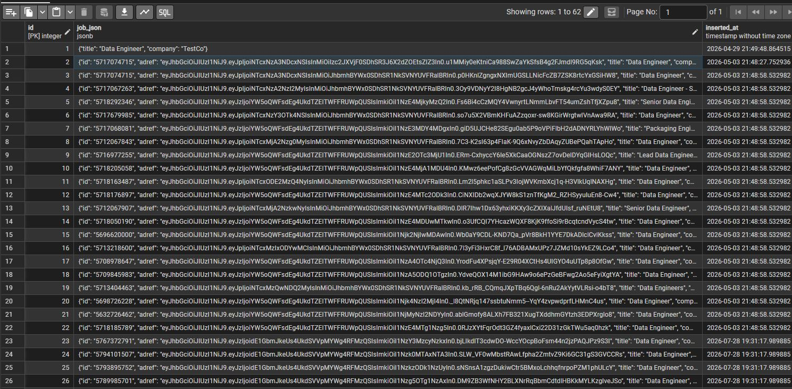
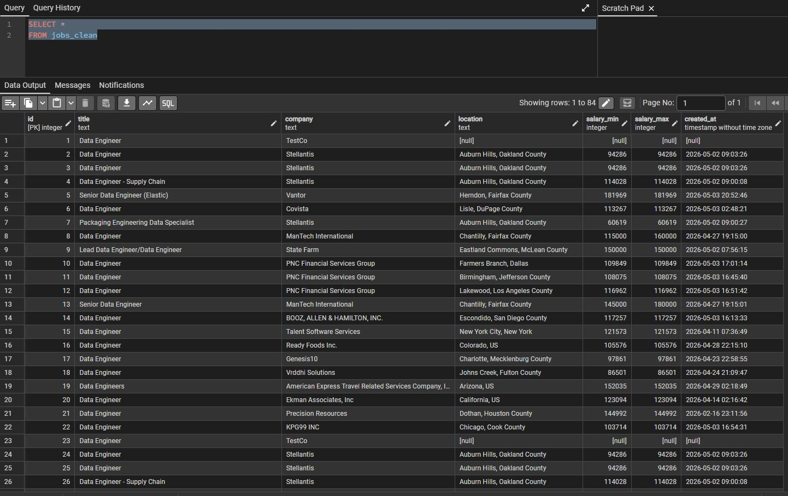

# Data Engineering Jobs Pipeline
Matthew Svenson, 2026
matthewjsvenson@gmail.com

## What is this?
A data pipeline designed to extract, transform, and load data from the Adzuna API onto a local database of your choosing. For this example I am using a local Postgres database.

## How does it work?
Adzuna API -> ingestion.py -> Local Postgres Database -> transform.py -> Local Postgres Database

## How do I run it?
To run this, make sure you have Postgres SQL (PostgreSQL 18.3) installed as well as Python(Python 3.14.6). 

Create a .env file with these variables included, make sure to throw this file in the same directory as the rest of the repo:
- apikey: The Adzuna API key that you are pulling the data from.
- appid: The appid that is given to you in your Adzuna API Account
- appkey: The appkey that is included in your apikey at the end of the url. Everything after the '=' until the end of the url
- dbname: Name of the database that you want to ingest the data into.
- user: Database user that you want to use to ingest the data into the database.
- password: Password of the Database user.
- host: Server name of the server your database lives on (localhost if you are using your own computer for the database)
- port: Port number needed to connect to the database

After this .env file is setup, it is best to run the ingestion.py file first to see if any errors have occured with setup by opening a cmd that is located on the repo directory and running this command:
```
python ingestion.py
```

After which, feel free to run a query on your Postgres Database and confirm if the data has landed successfully. After which you may want to clean it up with the transform script, which you can do by running the below command in the cmd:
```
python transform.py
```

## What does the end result look like?

This is an example of the result of the ingestion script.



This is an example of the result of the transform script.



## Why I built it this way.

## What are the limits and next steps.

### Limits

### Next steps:
- [ ] Refactor file structure and create a better README
- [ ] Snowflake Implementation
- [ ] dbt Implementation
- [ ] Production-harden the pipeline ()
- [ ] Airflow Orhchestration
- [ ] RAG over job postings
